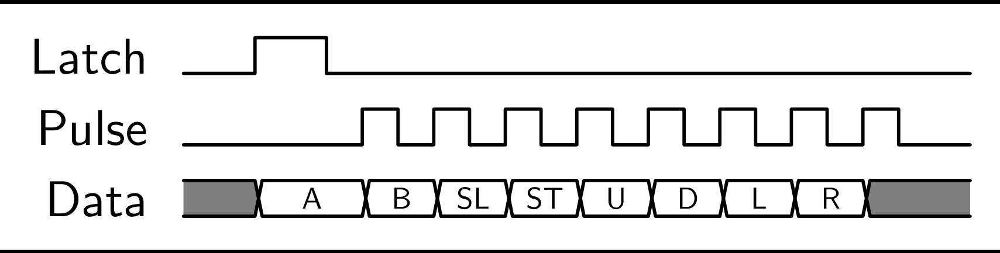
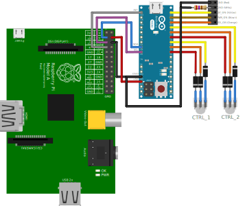

# SNESPad
NES / SNES gamepad handler for microcontrollers

### Supported MCU's
* Arduino Series
* AVR Series (WIP)
* TI MSP430 Series (WIP)

## NES Info
***
Controller Port Pins  

***
Controller Timing  

***
Power / Reset Board  

***
Arduino Micro NESBox Wiring  

***